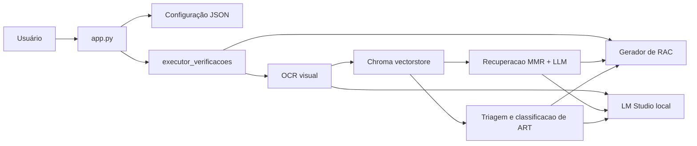

# Arquitetura

## Contexto

O CPD-DNIT é uma aplicação desktop monoprocesso. A interface roda na thread principal e delega cada verificação a uma thread daemon. Os serviços de IA são fornecidos por uma instância local do LM Studio.

## Componentes

| Componente | Responsabilidade |
|---|---|
| `app.py` | Interface, validação, histórico, descoberta dinâmica de checks, status do LM Studio e thread de execução |
| `scripts/executor_verificacoes.py` | Orquestração por PDF, caminho de saída, ART e chamada do gerador |
| `scripts/extracao_texto_pdf.py` | Renderização a 200 DPI, OCR visual, filtragem de linhas e criação de `Document` |
| `scripts/mecanismo_rag.py` | Embeddings, Chroma, recuperação MMR e respostas estruturadas |
| `scripts/verificacao_ART.py` | Recuperação de páginas candidatas e classificação visual de ART |
| `scripts/configuracao.py` | Endpoints, modelos e parâmetros técnicos compartilhados |
| `scripts/funcoes_comuns.py` | Caminhos, JSON, cancelamento, lote, versionamento e ciclo de vida de modelos |
| `checks/**` | Configuração declarativa de disciplina, código, tipo e perguntas |
| `templates/relatorio_pdf.py` | Tabelas, pontuação, fontes e composição A4 do RAC |

## Fluxo detalhado

1. A interface valida os campos e salva a configuração.
2. O módulo selecionado é importado dinamicamente e `principal()` é chamado.
3. O executor carrega a configuração e remove `vectorstores/` anterior.
4. Para cada PDF, o OCR carrega `glm-ocr`, renderiza e transcreve todas as páginas.
5. Linhas vazias, curtas ou repetidas mais de três vezes no documento são descartadas. Cada linha restante vira um documento com metadado `page` baseado em 1.
6. O Chroma cria embeddings e oferece um recuperador MMR com `k=25`, `fetch_k=50` e `lambda_mult=0.9`.
7. Cada pergunta recupera contexto e solicita resposta em três itens: existencia, trechos e conclusão.
8. A busca de ART recupera páginas candidatas e as classifica visualmente a 200 DPI.
9. O ReportLab calcula a conformidade e grava o próximo nome disponível.

## Integrações e modelos

| Função | Modelo | Endpoint |
|---|---|---|
| OCR | `glm-ocr` | API OpenAI `http://127.0.0.1:1234/v1` |
| Embeddings | `text-embedding-qwen3-embedding-0.6b` | API OpenAI local |
| Respostas | `google/gemma-3n-e4b` | API OpenAI local |
| ART visual | `google/gemma-4-e2b` | API OpenAI local |
| Carga/descarga | identificador do modelo | API nativa `/api/v1/models/*` |

Os endereços, nomes, chave simbólica `lm-studio` e contexto de carga `20000` estão centralizados em `scripts/configuracao.py`; ainda não há variáveis de ambiente.

## Persistencia

- `AppData/Local/CPD-DNIT/config.json`: configuração compartilhada pela interface, executor e relatório no Windows.
- `vectorstores/<nome-do-pdf>/`: índice Chroma temporário.
- diretório escolhido pelo usuário: RACs versionados.

Arquivos de imagem das páginas usam diretórios temporários do sistema e são removidos ao final do contexto.

## Cancelamento e erros

Um `threading.Event` global no executor e consultado entre etapas, páginas e perguntas. Não existe cancelamento da requisição HTTP em andamento. Exceções chegam a interface e são exibidas com traceback completo em uma caixa de erro.

## Limites de seguranca e privacidade

O processamento de IA aponta para `127.0.0.1`, portanto o desenho esperado e local. Ainda assim, caminhos e metadados ficam em JSON sem criptografia, respostas podem aparecer no console e não há autenticação efetiva na chave usada com o LM Studio. A distribuição deve preservar as licenças das fontes e dependências.
