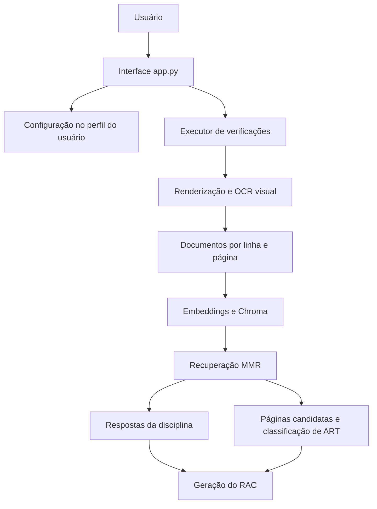

# Documentação consolidada do CPD-DNIT

## Apresentação

Este documento reúne e organiza, em uma única referência, o conteúdo anteriormente distribuído entre os arquivos de arquitetura, desenvolvimento, guia do usuário, manual do usuário, nota técnica, revisão técnica e catálogo de verificações do CPD-DNIT.

O objetivo é oferecer uma leitura contínua e compreensível para diferentes públicos. As primeiras partes explicam o propósito do sistema e sua utilização cotidiana. As partes seguintes detalham arquitetura, processamento, desenvolvimento, segurança, limitações, verificação de qualidade e melhorias recomendadas.

O CPD-DNIT é uma aplicação desktop de apoio à conferência de completude de documentos técnicos rodoviários. O programa recebe um ou vários arquivos PDF, transcreve suas páginas por OCR visual, procura evidências relacionadas aos requisitos de uma disciplina e gera, para cada PDF, um Relatório da Avaliação de Completude (RAC).

O sistema utiliza modelos de Inteligência Artificial executados localmente por meio do LM Studio. Seus resultados são indicativos: ajudam o analista a localizar informações e organizar a conferência, mas não substituem a leitura integral dos documentos, a interpretação de normas, a validação de cálculos, a análise de qualidade técnica nem a decisão de um profissional habilitado.

---

## 1. Finalidade, escopo e limites de responsabilidade

### 1.1 Finalidade

O CPD-DNIT busca reduzir o trabalho repetitivo envolvido na localização de itens mínimos em relatórios técnicos extensos. Ele automatiza uma triagem inicial e apresenta ao analista perguntas, conclusões, trechos potencialmente comprobatórios e páginas de referência.

O fluxo funcional inclui:

- preenchimento de metadados administrativos e técnicos;
- manutenção de um histórico local de contratos, processos e editais;
- seleção de um ou vários PDFs;
- escolha da fase e da disciplina que será verificada;
- transcrição visual das páginas por OCR;
- indexação semântica do conteúdo transcrito;
- recuperação de evidências relacionadas a cada pergunta;
- geração de respostas indicativas por um modelo de linguagem;
- busca e classificação visual de páginas que possam conter ART;
- cálculo de um percentual indicativo de completude;
- emissão de um RAC separado e versionado para cada documento.

### 1.2 O que o sistema verifica

O programa verifica a presença aparente de conteúdo relacionado às perguntas cadastradas para uma disciplina. Em outras palavras, procura indícios de que o documento aborda determinados itens mínimos.

### 1.3 O que o sistema não verifica

O CPD-DNIT não realiza:

- validação normativa integral;
- conferência de cálculos ou dimensionamentos;
- avaliação da qualidade ou suficiência técnica de uma solução;
- autenticação de documentos, assinaturas ou registros profissionais;
- validação de QR Code;
- confirmação jurídica da validade de uma ART;
- substituição da revisão humana ou da responsabilidade profissional.

Uma conclusão `SIM` significa apenas que o sistema encontrou conteúdo que interpretou como compatível com a pergunta. Ela não equivale a aprovação do documento ou declaração de conformidade.

---

## 2. Requisitos para utilização

### 2.1 Ambiente esperado

O ambiente principal previsto é Windows. Para executar o projeto a partir do código-fonte, recomenda-se Python 3.11 ou superior e um ambiente virtual dedicado.

Também são necessários:

1. LM Studio instalado e aberto;
2. servidor local do LM Studio ativo em `127.0.0.1:1234`;
3. modelos exigidos previamente instalados;
4. dependências Python instaladas;
5. PDFs íntegros, acessíveis e suficientemente legíveis;
6. espaço em disco para imagens temporárias, índices vetoriais e relatórios.

### 2.2 Modelos utilizados

| Função | Modelo padrão |
|---|---|
| Transcrição visual das páginas | `glm-ocr` |
| Geração de embeddings | `text-embedding-qwen3-embedding-0.6b` |
| Respostas sobre as disciplinas | `google/gemma-3n-e4b` |
| Classificação visual de ART | `google/gemma-4-e2b` |

Os identificadores devem corresponder exatamente aos modelos disponíveis na versão do LM Studio utilizada.

### 2.3 Preparação do ambiente Python

Execute os comandos a partir da raiz do projeto:

```powershell
python -m venv .venv
.\.venv\Scripts\Activate.ps1
python -m pip install --upgrade pip
pip install -r requirements.txt
python app.py
```

Os imports do projeto partem da raiz. Executar `app.py` a partir de outro diretório pode impedir a localização correta de módulos e recursos.

### 2.4 Indicador do LM Studio

O indicador exibido no rodapé consulta `GET /v1/models` aproximadamente a cada dez segundos. A cor verde informa que a API respondeu, mas não garante que os quatro modelos necessários estejam instalados, possam ser carregados ou sejam compatíveis com o pipeline completo.

---

## 3. Manual de utilização

### 3.1 Inicialização

Com o servidor local do LM Studio ativo, execute `python app.py` ou abra o executável distribuído. Uma tela de abertura precede a janela principal. Quando disponível, a configuração da utilização anterior é restaurada do perfil local do usuário.

Antes de iniciar uma avaliação, confirme a disponibilidade do LM Studio e aguarde a exibição da janela principal.

### 3.2 Campos da interface

| Campo | Obrigatório | Orientação e efeito |
|---|---:|---|
| Contrato | Não | Identificação também usada como chave do histórico local |
| Processo | Sim | Número ou identificação administrativa incluída no RAC |
| Edital | Não | Identificação do edital relacionado |
| Modalidade de contratação | Não | Modalidade aplicável ao empreendimento |
| Rodovia | Sim | Deve seguir `000/UF`, por exemplo `040/DF`; compõe o caminho e o nome do RAC |
| Segmento | Não | Descrição do trecho analisado |
| Extensão | Sim | Extensão do segmento, estudo ou projeto |
| Lote | Sim | Valores inteiramente numéricos são normalizados com dois dígitos |
| Tipo de projeto | Não | Classificação apresentada nos metadados do RAC |
| Fase | Sim | Define se a interface apresenta Estudos ou Projetos |
| Número da análise | Conforme a versão da interface | Referência administrativa exibida no RAC |
| Número do último relatório | Conforme a versão da interface | Metadado informativo; não controla a versão do arquivo |
| Analista | Sim | Responsável pela conferência |

Campos obrigatórios vazios são destacados. A rodovia deve conter três algarismos, uma barra e a sigla da unidade federativa em letras maiúsculas.

O campo “Número do último relatório” não interfere no versionamento automático. A versão do arquivo é determinada exclusivamente pela inspeção dos RACs já existentes no diretório de resultados.

### 3.3 Histórico de contratos

Ao informar um contrato já utilizado, a interface pode sugerir registros salvos. Quando o usuário seleciona uma sugestão, o Processo e o Edital associados podem ser recuperados. Ao executar uma avaliação, o conjunto atual é incluído ou atualizado no histórico.

No Windows, preferências e histórico são armazenados em:

```text
%USERPROFILE%\AppData\Local\CPD-DNIT\config.json
```

O arquivo é local e não possui criptografia. Por esse motivo, não se deve inserir informação sigilosa que não seja necessária ao relatório.

### 3.4 Seleção de documentos e resultados

O usuário pode selecionar um ou vários PDFs na mesma execução. Cada documento é processado integralmente e produz seu próprio RAC.

Procedimento recomendado:

1. selecione os arquivos PDF;
2. confira os nomes apresentados;
3. escolha a pasta de resultados;
4. preencha e revise os metadados;
5. escolha a fase;
6. selecione a verificação desejada;
7. clique em **Executar**.

Não mova, renomeie, sobrescreva ou exclua os PDFs enquanto o processamento estiver ativo.

### 3.5 Fases e verificações

As fases disponíveis são:

- Estudos Preliminares;
- Projeto Básico;
- Projeto Executivo.

Estudos Preliminares utiliza o catálogo em `checks/estudos`. Projeto Básico e Projeto Executivo utilizam o mesmo catálogo em `checks/projetos`; a fase escolhida é registrada nos metadados do RAC.

O nome mostrado na lista da interface deriva do nome do arquivo Python. Portanto, arquivos auxiliares não devem ser colocados nas pastas de checks, pois todo `*.py` pode ser descoberto e listado.

### 3.6 Execução e interrupção

Durante o processamento, o botão **Executar** muda para **Interromper** e a interface indica atividade. O trabalho inclui OCR, filtragem, indexação, respostas da disciplina, análise de ART e geração do relatório.

O tempo total varia principalmente de acordo com:

- quantidade de PDFs e páginas;
- resolução e legibilidade das páginas;
- complexidade visual de tabelas e desenhos;
- desempenho de CPU, GPU, memória e armazenamento;
- velocidade de carga e inferência dos modelos locais.

Ao clicar em **Interromper**, a aplicação sinaliza um cancelamento cooperativo. Uma requisição já enviada ao LM Studio não é encerrada imediatamente; a parada ocorre no ponto de controle seguinte. Fechar a janela também solicita cancelamento e inicia uma tentativa de descarregar os modelos conhecidos.

### 3.7 Estrutura do resultado

Os relatórios seguem, em termos gerais, esta organização:

```text
<pasta escolhida>/<rodovia>_LT<lote>/<disciplina>/
RAC-<versao>-<ano>_BR-<rodovia>_<codigo>_LT-<lote>.pdf
```

O sistema procura arquivos compatíveis no diretório da disciplina. A nova versão corresponde ao maior número encontrado acrescido de um.

O RAC contém:

- metadados preenchidos na interface;
- identificação do documento e da disciplina;
- tempo aproximado de processamento;
- perguntas verificadas;
- conclusão indicativa `SIM` ou `NÃO`;
- trechos recuperados e páginas citadas;
- item adicional referente à ART;
- percentual geral de completude;
- ressalva sobre a necessidade de conferência humana.

### 3.8 Interpretação correta do RAC

O percentual é calculado pela proporção de respostas cuja conclusão foi interpretada como `SIM`:

```text
quantidade de conclusões SIM / quantidade total de respostas * 100
```

Esse número representa a presença aparente dos conteúdos pesquisados. Não mede precisão, qualidade técnica, aderência integral às normas ou aceitabilidade do documento.

Antes de usar o RAC em uma decisão, o analista deve:

1. abrir o PDF original;
2. conferir todas as páginas citadas;
3. verificar se cada trecho realmente responde ao requisito;
4. avaliar o escopo contratual, as normas e os critérios técnicos aplicáveis;
5. corrigir ou registrar conclusões em que a IA esteja equivocada;
6. manter a decisão final sob responsabilidade humana.

### 3.9 Boas práticas de uso

- Use PDFs com orientação correta, boa resolução e texto legível.
- Separe documentos sem relação direta quando isso melhorar a interpretação.
- Reserve espaço em disco para arquivos temporários e índices.
- Confira os identificadores dos modelos após atualizar o LM Studio.
- Evite executar várias instâncias sobre a mesma pasta de trabalho.
- Mantenha cópia dos RACs considerados oficiais.
- Registre a versão da aplicação e dos modelos usada em avaliações relevantes.
- Nunca trate o percentual como aprovação automática.

---

## 4. Solução de problemas

| Sintoma | Causa provável ou ação recomendada |
|---|---|
| LM Studio desconectado | Inicie o servidor local e confirme a porta `1234` |
| Indicador verde, mas processamento falha | Confira individualmente a instalação e o identificador dos quatro modelos |
| Erro ao carregar modelo | Verifique o nome exato, a compatibilidade e os recursos disponíveis |
| Nenhum PDF selecionado | Selecione ao menos um arquivo antes de executar |
| Rodovia inválida | Use três dígitos, barra e UF maiúscula, como `040/DF` |
| Nenhum texto útil extraído | Confira integridade, proteção, resolução, orientação e legibilidade do PDF |
| Evidência ou página incorreta | Revise o original; OCR, recuperação semântica e modelo podem falhar |
| RAC não aparece | Confira a pasta configurada, permissões de escrita e mensagem de erro |
| Cancelamento demora | Aguarde a conclusão da requisição ao modelo que já está em andamento |
| Percentual parece incorreto | Examine o formato textual das conclusões, pois a pontuação depende do parser |
| Processamento muito lento | Avalie número de páginas, resolução e desempenho dos modelos e do hardware |

Ao solicitar suporte, reúna a versão da aplicação, versão do LM Studio, identificadores dos modelos, etapa em que o erro ocorreu, mensagem apresentada e características gerais do PDF. Não compartilhe documentos ou caminhos sigilosos sem autorização.

---

## 5. Arquitetura do sistema

### 5.1 Visão geral

O CPD-DNIT é uma aplicação desktop monoprocesso. A interface `customtkinter` ocupa a thread principal e delega a avaliação a uma thread daemon, evitando o congelamento visual durante o trabalho intensivo.



As integrações de IA apontam para uma instância local do LM Studio. A API compatível com OpenAI é usada para inferência, e a API nativa do LM Studio é usada no gerenciamento de carga e descarga de modelos.

### 5.2 Componentes

| Componente | Responsabilidade principal |
|---|---|
| `app.py` | Interface, validação, persistência, histórico, descoberta de checks, status do servidor, thread e cancelamento |
| `scripts/configuracao.py` | Endpoints, modelos, chave simbólica, contexto e timeouts |
| `scripts/funcoes_comuns.py` | Caminhos, JSON, lote, versionamento, cancelamento e ciclo de vida dos modelos |
| `scripts/extracao_texto_pdf.py` | Renderização de páginas, OCR visual, filtragem e criação de documentos LangChain |
| `scripts/mecanismo_rag.py` | Embeddings, Chroma, recuperação MMR, prompt e respostas estruturadas em texto |
| `scripts/verificacao_ART.py` | Recuperação de páginas candidatas e classificação visual de ART |
| `scripts/executor_verificacoes.py` | Orquestração do pipeline para cada PDF e chamada do gerador de RAC |
| `checks/estudos` | Declarações das verificações de Estudos Preliminares |
| `checks/projetos` | Declarações das verificações de Projeto Básico e Executivo |
| `templates/relatorio_pdf.py` | Parsing das respostas, pontuação e composição A4 pelo ReportLab |
| `tests/test_scripts.py` | Testes unitários dos contratos puros existentes |

### 5.3 Tecnologias principais

- `customtkinter`, para a interface desktop;
- `Pillow`, para recursos de imagem;
- `PyMuPDF`, para abertura e renderização de PDFs;
- `openai`, para clientes da API local;
- `langchain-core`, `langchain-openai` e `langchain-chroma`, para o fluxo RAG;
- Chroma, para o índice vetorial temporário;
- `reportlab`, para criação do RAC;
- `requests`, para carga e descarga dos modelos.

### 5.4 Configuração técnica padrão

| Parâmetro | Valor |
|---|---|
| API compatível com OpenAI | `http://127.0.0.1:1234/v1` |
| API nativa de modelos | `http://127.0.0.1:1234/api/v1/models` |
| Chave simbólica | `lm-studio` |
| Contexto solicitado na carga | `20000` tokens |
| Timeout de gerenciamento | `300` segundos |

Esses parâmetros estão centralizados em `scripts/configuracao.py`. Na implementação documentada, não são editáveis pela interface nem substituíveis por variáveis de ambiente.

### 5.5 Persistência

Interface, executor e relatório compartilham o arquivo de configuração do perfil do usuário. Ele guarda campos da interface, caminhos e histórico de contratos, sem criptografia, banco de dados ou controle de concorrência.

Os índices Chroma são criados em:

```text
vectorstores/<nome-do-pdf>/
```

O índice anterior é removido no início da verificação e recriado. Imagens das páginas são armazenadas em diretórios temporários do sistema durante OCR e ART e removidas ao final do contexto normal de processamento.

---

## 6. Fluxo técnico detalhado

### 6.1 Validação e seleção do check

A interface valida os campos obrigatórios, a presença de PDFs e o diretório de resultados. A rodovia deve corresponder ao padrão `^\d{3}/[A-Z]{2}$`, e lotes numéricos são normalizados para dois dígitos.

O módulo da disciplina é descoberto e importado dinamicamente. Sua função `principal()` encaminha a configuração declarativa para o executor comum.

### 6.2 OCR visual

Para cada PDF, o sistema carrega `glm-ocr`, renderiza todas as páginas a 200 DPI, em RGB e sem transparência, e envia cada imagem em Base64 ao modelo.

O prompt solicita transcrição apenas do conteúdo visível, preservando ordem, quebras, títulos, listas e tabelas, além de marcar trechos ilegíveis. O cancelamento é verificado antes e depois de cada página, mas não interrompe uma requisição já iniciada.

Ao final da etapa, o modelo de OCR é descarregado.

### 6.3 Filtragem do texto

As linhas transcritas são contadas ao longo de todo o PDF. O sistema descarta:

- linhas vazias;
- linhas com até três caracteres;
- linhas repetidas mais de três vezes no documento.

Cada linha restante se torna um `Document` independente com metadado `page`, usando numeração humana iniciada em 1.

Essa heurística reduz cabeçalhos e rodapés repetitivos, mas pode remover conteúdo válido, especialmente rótulos curtos ou informações intencionalmente repetidas. A granularidade de uma linha também pode fragmentar parágrafos e tabelas.

### 6.4 Vetorização e recuperação

Os documentos são vetorizados com `text-embedding-qwen3-embedding-0.6b` e persistidos no Chroma. O recuperador usa Maximum Marginal Relevance com:

- `k = 25` documentos retornados;
- `fetch_k = 50` candidatos;
- `lambda_mult = 0.9`.

Cada pergunta é combinada com sua informação adicional e enviada ao recuperador. O contexto entregue ao modelo conserva o conteúdo e a página de cada documento selecionado.

### 6.5 Respostas da disciplina

O modelo `google/gemma-3n-e4b`, com temperatura zero, recebe instruções para responder exclusivamente com base no contexto recuperado. O formato esperado contém:

1. informação encontrada;
2. trechos comprobatórios e respectivas páginas;
3. conclusão `SIM` ou `NÃO`.

Os modelos de embeddings e conversação são descarregados no bloco de finalização, inclusive quando ocorre erro.

### 6.6 Identificação de ART

A avaliação de ART é automática e não aparece como check independente. O recuperador pesquisa termos relacionados a Anotação de Responsabilidade Técnica, responsável técnico, contratante, obra ou serviço e atividade técnica.

As páginas recuperadas tornam-se candidatas. Cada candidata é renderizada a 200 DPI e analisada visualmente por `google/gemma-4-e2b`. O prompt procura identificação explícita de ART e os grupos de informação esperados. Apenas uma resposta estrita `SIM` faz com que a página seja incluída.

O resultado de ART é convertido para o mesmo formato textual das outras respostas e participa do percentual do RAC. Como a classificação visual é aplicada somente às páginas recuperadas semanticamente, uma ART presente em página não recuperada pode não ser identificada.

### 6.7 Geração do RAC

O ReportLab produz um documento A4. A aplicação usa fontes Liberation Sans distribuídas com o projeto e recorre à Helvetica quando necessário.

O gerador interpreta as respostas por expressões regulares, extrai conclusão, trechos e páginas e calcula a pontuação. Variações inesperadas na redação do modelo podem prejudicar tanto a composição da tabela quanto o percentual final.

### 6.8 Concorrência, cancelamento e erros

Existe uma única thread de processamento por instância da interface. Um `threading.Event` é compartilhado entre executor, OCR, RAG e ART. Quando o evento é sinalizado, a exceção `ProcessamentoInterrompido` encerra o fluxo no próximo ponto cooperativo.

Chamadas HTTP não recebem esse evento e não são abortadas no meio. Exceções do processamento chegam à interface; na implementação atual, o traceback completo pode ser mostrado ao usuário.

### 6.9 Gerenciamento de modelos

Os endpoints nativos `/load` e `/unload` recebem a chave simbólica e o identificador do modelo. Um conjunto em memória registra os modelos carregados pelo processo. No fechamento, a aplicação tenta descarregar modelos solicitados, registrados e conhecidos e registra falhas individuais no console.

---

## 7. Catálogo de verificações

### 7.1 Estudos Preliminares

| Arquivo | Disciplina | Código | Perguntas declaradas |
|---|---|---:|---:|
| `estudo_geologico.py` | Estudo Geológico | EGEO | 3 |
| `estudo_geotecnico.py` | Estudo Geotécnico | EGTC | 5 |
| `estudo_hidrologico.py` | Estudo Hidrológico | EHID | 7 |
| `estudo_tracado.py` | Estudo de Traçado | ETRC | 6 |
| `estudo_trafego.py` | Estudo de Tráfego | ETRF | 4 |

### 7.2 Projeto Básico e Projeto Executivo

| Arquivo | Disciplina | Código | Perguntas declaradas |
|---|---|---:|---:|
| `projeto_contencao.py` | Contenção | PCTC | 6 |
| `projeto_geometrico.py` | Geometria | PGMT | 4 |
| `projeto_obras_complementares.py` | Obras Complementares | POBC | 3 |
| `projeto_pavimentacao.py` | Pavimentação | PPAV | 4 |
| `projeto_sinalizacao.py` | Sinalização | PSIN | 4 |
| `projeto_terraplanagem.py` | Terraplanagem | PTER | 6 |

Projeto Básico e Projeto Executivo compartilham exatamente os mesmos arquivos e perguntas. A diferença de fase é registrada como metadado.

### 7.3 Pergunta adicional de ART

Depois das perguntas declaradas, o executor acrescenta automaticamente:

```text
O documento apresenta Anotação de Responsabilidade Técnica (ART)?
```

Esse item participa da pontuação geral.

### 7.4 Estabilidade dos códigos

O código da disciplina faz parte do nome do RAC e da descoberta da próxima versão. Alterá-lo cria, na prática, uma sequência de versionamento diferente. Os códigos devem ser únicos, estáveis e tratados como parte do contrato de compatibilidade do sistema.

---

## 8. Desenvolvimento e extensão

### 8.1 Convenções atuais

- nomes, mensagens e interface em português;
- `pathlib.Path` para manipulação de caminhos;
- checks declarativos por `ConfiguracaoVerificacao`;
- páginas apresentadas ao usuário com numeração iniciada em 1;
- código de saída curto e estável por disciplina;
- cancelamento representado por `ProcessamentoInterrompido`;
- recursos empacotados resolvidos por `sys._MEIPASS`.

### 8.2 Adição de uma verificação

Crie o módulo na pasta correspondente e use a estrutura abaixo:

```python
"""Verificação de conteúdo mínimo da disciplina."""

from scripts.executor_verificacoes import (
    ConfiguracaoVerificacao,
    executar_verificacao_conteudo,
)


CONFIGURACAO_VERIFICACAO = ConfiguracaoVerificacao(
    nome_disciplina="Nome da disciplina",
    codigo_saida="COD",
    tipo_modelo="projeto",  # ou "estudo"
    perguntas=[
        {
            "pergunta": "O documento apresenta o item esperado?",
            "informacao_adicional": "Critérios ou sinônimos relevantes.",
        },
    ],
)


def principal() -> None:
    executar_verificacao_conteudo(CONFIGURACAO_VERIFICACAO)
```

O nome do arquivo é descoberto automaticamente. Não crie um check separado para ART, pois o executor adiciona essa pergunta a todas as disciplinas.

### 8.3 Regras para perguntas

- Formule uma pergunta objetiva por requisito.
- Registre sinônimos, critérios e contexto em `informacao_adicional`.
- Não exija conhecimento externo, pois o modelo deve usar apenas o contexto recuperado.
- Preserve o dicionário com as chaves `pergunta` e `informacao_adicional`.
- Não duplique a pergunta de ART.
- Evite perguntas compostas que possam resultar em uma conclusão ambígua.

### 8.4 Validação antes de entregar

Execute, no mínimo:

```powershell
python -m compileall -q app.py scripts checks templates
python -m pip check
python -m unittest discover -s tests
```

O roteiro manual deve cobrir:

- inicialização sem LM Studio;
- indicador conectado;
- validação dos campos;
- processamento de um PDF curto;
- processamento de vários PDFs;
- interrupção durante OCR e durante perguntas;
- incremento de versão do RAC;
- abertura do relatório;
- fechamento da aplicação com processamento ativo.

### 8.5 Empacotamento

O projeto prevê empacotamento por PyInstaller:

```powershell
pyinstaller --onefile --noconsole app.py `
  --add-data "checks;checks" `
  --add-data "scripts;scripts" `
  --add-data "figs;figs" `
  --add-data "templates;templates"
```

O executável não inclui o LM Studio nem os modelos. A distribuição deve ser testada em uma máquina limpa e incluir as licenças aplicáveis ao projeto, dependências, fontes e modelos.

### 8.6 Checklist de publicação

1. tratar ou aceitar formalmente os achados técnicos de alta prioridade;
2. atualizar `CHANGELOG.md`;
3. executar compilação, verificação de dependências e testes;
4. concluir o roteiro de testes manuais;
5. confirmar identificadores e compatibilidade dos modelos;
6. revisar licenças e política de dados;
7. validar o executável em ambiente limpo;
8. registrar a versão da aplicação e do ambiente de inferência.

---

## 9. Segurança, privacidade e operação

As chamadas de IA usam `127.0.0.1`, de modo que o desenho esperado mantém o processamento no computador. Isso não elimina outras responsabilidades de segurança.

Pontos relevantes:

- configuração e histórico ficam em JSON sem criptografia;
- caminhos locais e detalhes técnicos podem aparecer em tracebacks;
- a chave usada pelo serviço local é simbólica e não representa autenticação forte;
- a aplicação não possui controle interno de acesso;
- não existe política automática de retenção dos RACs;
- a proteção do computador e da pasta de resultados é externa ao programa;
- mensagens e respostas podem aparecer no console;
- não há telemetria nem logging estruturado na implementação documentada.

Para uso institucional, recomenda-se definir classificação dos dados, permissões de pastas, retenção, descarte, cópias de segurança, gestão de incidentes e regras para compartilhamento dos RACs.

---

## 10. Limitações técnicas consolidadas

- Dependência integral de quatro modelos locais e de identificadores fixos.
- Ausência de modo degradado quando um modelo está indisponível.
- Indicador de status limitado à resposta do endpoint, sem teste completo do pipeline.
- Parâmetros técnicos não configuráveis pela interface.
- OCR de todas as páginas, com custo proporcional ao tamanho do documento.
- Sensibilidade do OCR a imagens ruins, páginas giradas, tabelas densas e texto pequeno.
- Filtragem heurística que pode remover linhas válidas repetidas.
- Indexação com granularidade de uma linha, capaz de fragmentar contexto.
- Recuperação limitada aos candidatos selecionados pelo MMR.
- ART limitada às páginas encontradas na busca semântica.
- Resposta do modelo tratada por expressões regulares, sem schema validado.
- Percentual vulnerável a variações textuais da conclusão.
- Cancelamento não instantâneo de requisições HTTP.
- Tracebacks técnicos potencialmente expostos ao usuário.
- Ausência de validação normativa, autenticidade, assinatura ou QR Code.
- Cobertura limitada de testes de integração e de interface.
- Ausência documentada de CI, lint e verificação estática de tipos.
- Ausência de política formal de logs, retenção e limpeza em falhas.
- Ausência de limite específico de páginas e tratamento dedicado a PDF protegido.

---

## 11. Revisão técnica e evolução recomendada

### 11.1 Melhorias já incorporadas

A revisão técnica registra as seguintes correções:

- unificação do arquivo de configuração usado por interface, executor e relatório;
- criação de uma lista local de perguntas para cada PDF, evitando mutação da configuração declarativa;
- remoção do check duplicado de ART;
- remoção do módulo de QR Code que não participava do fluxo principal;
- inclusão do modelo visual de ART no ciclo de descarregamento;
- centralização de endpoints, modelos, chave, contexto e timeouts;
- correção de contratos de tipo para perguntas, respostas e páginas de ART;
- declaração das dependências diretas e inclusão de testes para funções puras.

### 11.2 Achados pendentes prioritários

#### Resposta estruturada

O maior risco de consistência está no parsing textual. O sistema deve preferir uma resposta estruturada, com schema validado, campos explícitos para conclusão, evidências e páginas e tratamento claro de resposta inválida.

#### Mensagens de erro e observabilidade

Tracebacks completos devem ser registrados em log técnico, enquanto o usuário recebe uma mensagem curta, acionável e acompanhada por um identificador de incidente. Também são desejáveis logs estruturados, rotação, níveis de severidade e proteção de dados sensíveis.

#### Configuração externa

Portas, endpoints, modelos, contexto e timeouts deveriam ser externalizados por configuração validada ou variáveis de ambiente. Isso permitiria adaptar a instalação sem editar o código ou recompilar o executável.

#### Diagnóstico inicial dos modelos

A aplicação deveria verificar a presença e a capacidade de carga de cada modelo antes do processamento, apresentando claramente qual dependência está ausente ou incompatível.

### 11.3 Lacunas de qualidade

- faltam clientes simulados do LM Studio para testes de pipeline;
- faltam testes de contrato com a versão alvo do servidor;
- faltam testes de interface, PDFs reais, falhas HTTP e cancelamento de ponta a ponta;
- falta validação automatizada da renderização do RAC;
- faltam integração contínua, lint e verificação de tipos;
- faltam inventário formal de terceiros e licença do projeto;
- o `CHANGELOG.md` ainda contém referências históricas a estruturas anteriores.

### 11.4 Ordem recomendada de evolução

1. adotar resposta estruturada e validação de schema;
2. simular os clientes do LM Studio em testes do pipeline;
3. adicionar lint, tipos e integração contínua;
4. melhorar erros, logs e configuração externa;
5. validar previamente modelos e recursos do ambiente;
6. executar aceitação com uma amostra representativa de documentos;
7. comparar os resultados com revisão independente de especialistas;
8. formalizar licença, política de dados, retenção e suporte.

---

## 12. Referência rápida

### Para executar

```powershell
.\.venv\Scripts\Activate.ps1
python app.py
```

### Para validar o código

```powershell
python -m compileall -q app.py scripts checks templates
python -m pip check
python -m unittest discover -s tests
```

### Configuração do usuário

```text
%USERPROFILE%\AppData\Local\CPD-DNIT\config.json
```

### Servidor local

```text
http://127.0.0.1:1234
```

### Regra fundamental de interpretação

> O RAC é um instrumento de apoio à conferência. Toda evidência, página e conclusão deve ser confirmada no documento original por um analista responsável.

---

## Conclusão

O CPD-DNIT implementa um fluxo local e especializado de triagem de completude documental. Ele converte páginas em texto, filtra e indexa evidências, aplica perguntas declarativas, identifica páginas prováveis de ART e materializa os resultados em relatórios versionados.

A separação entre interface, configuração, OCR, recuperação semântica, análise visual de ART, catálogo de verificações e geração do RAC favorece a manutenção e a inclusão de novas disciplinas. Ao mesmo tempo, o resultado permanece dependente da qualidade do PDF, da recuperação semântica, do comportamento dos modelos e da interpretação de respostas textuais.

Por essas razões, o CPD-DNIT deve continuar sendo apresentado como apoio técnico. Seu percentual não representa aprovação, conformidade normativa ou qualidade do projeto. A maturidade do sistema pode ser ampliada principalmente por respostas estruturadas, testes de integração, configuração externa, diagnóstico de modelos, melhor observabilidade e validação com documentos reais revisados por especialistas.
