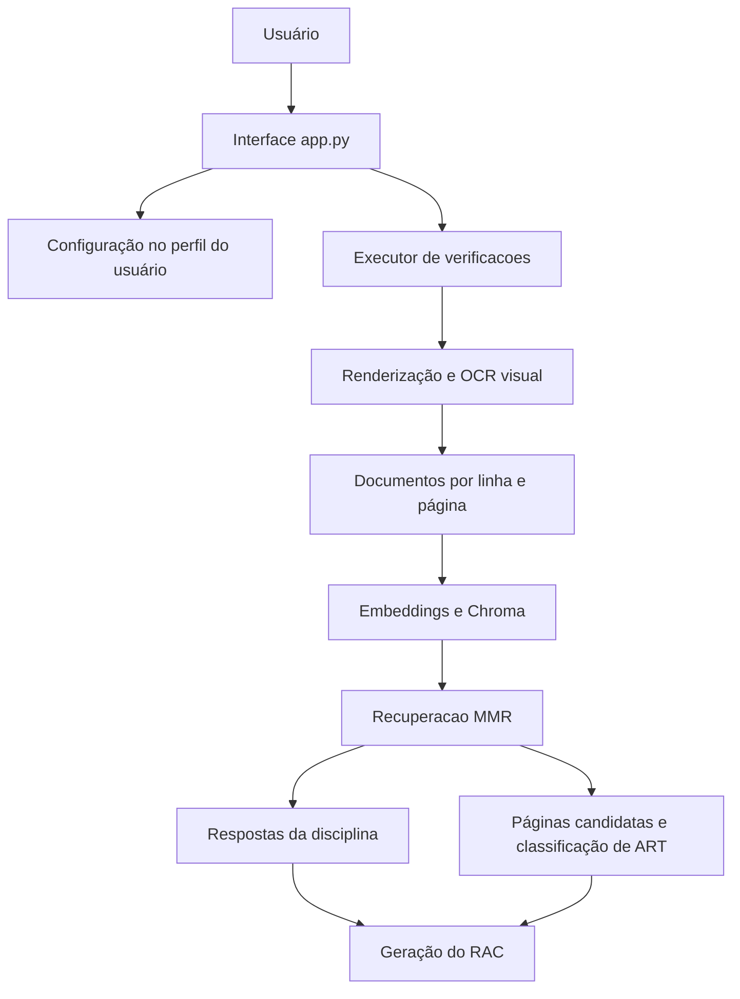

# Nota Técnica - Sistema CPD-DNIT

## Introdução

### 1. Objeto

Esta nota técnica descreve o CPD-DNIT, aplicação desktop desenvolvida em Python para apoiar a avaliação de completude documental de estudos e projetos rodoviários. O sistema recebe relatórios em PDF, extrai seu conteúdo por OCR visual, recupera evidências por mecanismo RAG, consulta modelos locais de Inteligência Artificial e gera o Relatório da Avaliação de Completude (RAC).

### 2. Finalidade e escopo

A finalidade é reduzir o trabalho repetitivo de localizar itens mínimos em documentos extensos, mantendo o analista como responsável pela verificação final. O escopo funcional compreende cadastro de metadados, seleção de PDFs, escolha de disciplina, processamento local, identificação de páginas de ART, cálculo indicativo de completude e emissão do RAC.

O sistema avalia existencia aparente de informação. Não executa verificação normativa completa, validação de cálculos, autenticação de documentos, assinatura digital, registro profissional ou QR Code.

### 3. Premissas

- execução principal em ambiente Windows;
- Python 3.11 ou superior;
- servidor LM Studio acessível localmente em `127.0.0.1:1234`;
- modelos previamente instalados e compatíveis com os endpoints utilizados;
- documentos PDF acessiveis, íntegros e suficientemente legíveis;
- revisão humana obrigatória das evidências e conclusões.

## Desenvolvimento

### 4. Arquitetura geral

O CPD-DNIT é uma aplicação desktop monoprocesso com interface `customtkinter`. A interface ocupa a thread principal; a avaliação é executada em uma thread daemon para evitar bloqueio visual. As chamadas de IA são realizadas contra o LM Studio local pela API compatível com OpenAI e pela API nativa de gerenciamento de modelos.



### 5. Organização do código

| Componente | Função técnica |
|---|---|
| `app.py` | Interface, validação, persistencia, descoberta de checks, thread, cancelamento e status do servidor |
| `scripts/configuracao.py` | Endpoints, chave local, modelos, contexto e timeouts |
| `scripts/funcoes_comuns.py` | Caminhos, configuração JSON, normalização, versionamento, cancelamento e modelos |
| `scripts/extracao_texto_pdf.py` | Renderização de páginas, OCR visual, filtragem e documentos LangChain |
| `scripts/mecanismo_rag.py` | Chroma, embeddings, recuperação MMR, prompt e modelo conversacional |
| `scripts/verificacao_ART.py` | Recuperação de páginas candidatas e classificação visual de ART |
| `scripts/executor_verificacoes.py` | Orquestração por PDF e chamada do gerador de relatório |
| `checks/estudos` | Declaracoes das cinco verificações de estudos |
| `checks/projetos` | Declaracoes das seis verificações de projetos |
| `templates/relatorio_pdf.py` | Parsing das respostas, pontuação e composição A4 pelo ReportLab |
| `tests/test_scripts.py` | Testes unitários dos contratos puros do sistema |

### 6. Tecnologias e dependências

- `customtkinter` para interface;
- `Pillow` para recursos de imagem da interface;
- `PyMuPDF` para abertura e renderização de PDF;
- `openai` para clientes da API local;
- `langchain-core`, `langchain-openai` e `langchain-chroma` para RAG;
- Chroma para persistencia vetorial temporaria;
- `reportlab` para geração do RAC;
- `requests` para carga e descarga de modelos;

### 7. Configuração técnica

Os parâmetros ficam centralizados em `scripts/configuracao.py`:

| Parametro | Valor padrão |
|---|---|
| API compatível com OpenAI | `http://127.0.0.1:1234/v1` |
| API de modelos | `http://127.0.0.1:1234/api/v1/models` |
| Chave simbólica | `lm-studio` |
| Contexto solicitado na carga | `20000` tokens |
| Timeout de gerenciamento | `300` segundos |
| OCR | `glm-ocr` |
| Embeddings | `text-embedding-qwen3-embedding-0.6b` |
| Conversação | `google/gemma-3n-e4b` |
| Classificação de ART | `google/gemma-4-e2b` |

Esses valores não podem ser alterados pela interface nem por variáveis de ambiente na implementação atual.

### 8. Persistencia e caminhos

No Windows, interface, executor e relatório compartilham:

```text
%USERPROFILE%\AppData\Local\CPD-DNIT\config.json
```

O arquivo armazena campos da interface, caminhos de entrada e saída e histórico de contratos. Não há criptografia, banco de dados ou controle de concorrência.

Os índices Chroma são criados em `vectorstores/<nome-do-pdf>/`. A pasta anterior é removida no início da verificação e cada coleção do PDF é recriada. Imagens de páginas são gravadas em diretórios temporários durante OCR e ART.

### 9. Catálogo de verificações

Estudos Preliminares possuem Estudo Geológico (`EGEO`), Geotécnico (`EGTC`), Hidrológico (`EHID`), Traçado (`ETRC`) e Tráfego (`ETRF`).

Projeto Básico e Projeto Executivo compartilham Contenção (`PCTC`), Geometria (`PGMT`), Obras Complementares (`POBC`), Pavimentação (`PPAV`), Sinalização (`PSIN`) e Terraplanagem (`PTER`).

Cada check é uma declaração `ConfiguracaoVerificacao` com nome da disciplina, código de saída, tipo de relatório e lista de dicionários contendo `pergunta` e `informacao_adicional`. A interface descobre automaticamente arquivos Python na pasta correspondente à fase.

Não existe check selecionável de ART. O executor acrescenta a pergunta de ART a qualquer disciplina depois das perguntas declaradas.

### 10. Fluxo de processamento

#### 10.1 Validação e inicialização

A interface exige Processo, Rodovia, Extensão, Lote, Fase, Analista, ao menos um PDF e diretório de resultados. A Rodovia deve corresponder a `^\d{3}/[A-Z]{2}$`. O Lote numérico é normalizado para dois dígitos.

O check selecionado é importado dinamicamente com `importlib`. Seu método `principal()` delega ao executor comum.

#### 10.2 OCR

Para cada PDF, `glm-ocr` é carregado. Todas as páginas são renderizadas a 200 DPI, em RGB e sem transparência, e enviadas individualmente como imagem Base64. O prompt solicita somente transcrição visível, preservação de ordem, quebras, títulos, listas e tabelas, com marcador para trecho ilegível.

Ao final, o modelo OCR é descarregado. O cancelamento é verificado antes e depois de cada página, mas não interrompe uma requisição já iniciada.

#### 10.3 Filtragem documental

As linhas transcritas são contadas em todo o PDF. São descartadas linhas vazias, com até três caracteres ou repetidas mais de três vezes. Cada linha restante se torna um `Document` independente, com `metadata["page"]` baseado em numeracao humana iniciada em 1.

Essa estratégia reduz cabeçalhos e rodapés, mas pode excluir informações validas repetidas e fragmentar tabelas ou parágrafos.

#### 10.4 Indexação e recuperação

Os documentos são vetorizados com `text-embedding-qwen3-embedding-0.6b` e persistidos no Chroma. O recuperador utiliza Maximum Marginal Relevance com:

- `k = 25` documentos retornados;
- `fetch_k = 50` candidatos;
- `lambda_mult = 0.9`.

Cada pergunta, somada a sua informação adicional, consulta o recuperador. O contexto enviado ao modelo conserva página e conteúdo de cada documento recuperado.

#### 10.5 Resposta da disciplina

O modelo `google/gemma-3n-e4b`, com temperatura zero, recebe instrução para usar exclusivamente o contexto. A resposta esperada possui três itens: informação encontrada, trechos comprobatórios com páginas e conclusão `SIM` ou `NAO`.

Os modelos de embeddings e conversação são descarregados no bloco de finalização mesmo quando ocorre erro.

#### 10.6 Identificação de ART

O mesmo recuperador consulta termos de ART, responsável técnico, contrato, obra ou serviço e atividade técnica. As páginas dos documentos recuperados tornam-se candidatas.

Cada candidata é renderizada a 200 DPI e enviada ao `google/gemma-4-e2b`. O prompt exige identificação textual explícita de ART e presença dos grupos responsável técnico, contratante, obra ou serviço e atividade técnica. Somente resposta estrita `SIM` inclui a página.

O resultado é convertido para o mesmo formato textual das demais perguntas e participa da pontuação. O modelo visual é descarregado ao final.

#### 10.7 Geração do RAC

O ReportLab gera documento A4 com fontes Liberation Sans distribuídas no projeto, ou Helvetica como alternativa. O relatório apresenta metadados, conformidade geral, quantidade de itens, perguntas, conclusões, evidências, páginas, tempo e ressalva de responsabilidade humana.

A pontuação é:

```text
quantidade de respostas com SIM na conclusao / quantidade total de respostas * 100
```

O parser usa expressões regulares sobre a resposta textual. Portanto, desvios do modelo podem afetar extração de evidências e pontuação.

### 11. Nomenclatura e versionamento

O diretório e o arquivo seguem:

```text
<resultados>/<rodovia>_LT<lote>/<disciplina>/
RAC-<NNN>-<ano>_BR-<rodovia>_<codigo-disciplina>_LT-<lote>.pdf
```

O sistema procura nomes compatíveis no diretório e utiliza o maior número encontrado mais um. O campo Número do último relatório é apenas metadado e não participa desse cálculo.

### 12. Concorrência e cancelamento

Existe uma única thread de processamento por instância da interface. Um `threading.Event` é compartilhado com executor, OCR, RAG e ART. Quando sinalizado, `ProcessamentoInterrompido` encerra o fluxo no próximo ponto cooperativo.

Chamadas HTTP ao modelo não recebem o evento e não são abortadas. A thread e daemon; o fechamento da interface sinaliza cancelamento, tenta descarregar modelos e encerra a janela.

### 13. Gerenciamento de modelos

Os endpoints nativos `/load` e `/unload` recebem autenticação simbólica e identificador do modelo. Um conjunto em memória registra modelos carregados pelo processo. No fechamento, a aplicação tenta descarregar modelos solicitados, registrados e conhecidos, ignorando falhas individuais depois de registra-las no console.

### 14. Tratamento de erros e observabilidade

Erros do processamento são capturados pela thread e exibidos em caixa de diálogo com traceback. Mensagens de carga, descarga, OCR e respostas podem ser escritas no console. Não há logging estruturado, rotação, identificador de incidente ou telemetria.

O indicador do LM Studio consulta `GET /v1/models` a cada 10 segundos, com timeout de 3 segundos. Ele mede disponibilidade do endpoint, não prontidão completa do pipeline.

### 15. Seguranca e privacidade

O desenho utiliza `127.0.0.1`, mantendo chamadas de IA no computador quando o LM Studio esta configurado localmente. Ainda assim:

- configuração e histórico ficam em JSON sem criptografia;
- caminhos locais podem aparecer em tracebacks;
- não há autenticação efetiva para o serviço local;
- não há controle de acesso dentro da aplicação;
- não há política automática de retenção dos RACs;
- a proteção do computador e da pasta de resultados e externa ao programa.

### 16. Empacotamento

O projeto preve PyInstaller `--onefile --noconsole`, incluindo `checks`, `scripts`, `figs` e `templates`. O executável não incorpora LM Studio nem modelos. Recursos empacotados são resolvidos por `sys._MEIPASS`; dados persistentes permanecem no perfil do usuário.

Uma distribuição deve ser validada em máquina limpa e acompanhada de licenças do projeto, dependências, fontes e modelos aplicáveis.

### 17. Verificação de qualidade

A validação disponível inclui compilação de todos os módulos, `pip check`, verificação do diff e testes unitários para normalização de lote, versionamento de RAC, composição da resposta de ART e pontuação.

A cobertura ainda não inclui interface, renderização do RAC, PDFs reais, falhas HTTP, clientes simulados do LM Studio, cancelamento de ponta a ponta ou compatibilidade entre versões dos modelos.

### 18. Limitacoes técnicas consolidadas

- dependência integral de quatro modelos locais e identificadores fixos;
- parâmetros técnicos não configuraveis pela interface;
- OCR integral de todas as páginas, com custo proporcional ao documento;
- filtragem heurística de linhas repetidas;
- granularidade de uma linha por documento vetorial;
- recuperação limitada aos candidatos MMR;
- ART limitada as páginas recuperadas semanticamente;
- saída do LLM tratada por expressões regulares, sem schema estruturado;
- ausência de QR Code, autenticidade, assinatura e validação normativa;
- cancelamento não instantaneo de requisições;
- tracebacks técnicos expostos ao usuário;
- ausência de CI, lint, verificação estática e testes de integração;
- ausência de licença e política formal de logs e dados.

## Conclusão

O CPD-DNIT implementa um fluxo local e especializado para triagem de completude documental: converte páginas em texto, indexa evidências, aplica perguntas declarativas, identifica páginas prováveis de ART e materializa o resultado em RAC versionado. A separação entre interface, configuração, OCR, RAG, ART, checks e relatório favorece manutenção e inclusão de novas disciplinas.

O resultado deve permanecer classificado como apoio técnico, pois depende de qualidade de imagem, recuperação semântica, comportamento dos modelos e parsing textual. O percentual não equivale a aprovação, conformidade normativa ou qualidade do projeto.

Para elevar a maturidade operacional, recomenda-se estruturar a resposta do LLM com schema validado, simular os clientes externos em testes, ampliar cobertura de integração, externalizar configuração, aprimorar mensagens e logs, definir política de dados e realizar aceitação com amostra representativa revisada por especialistas.
